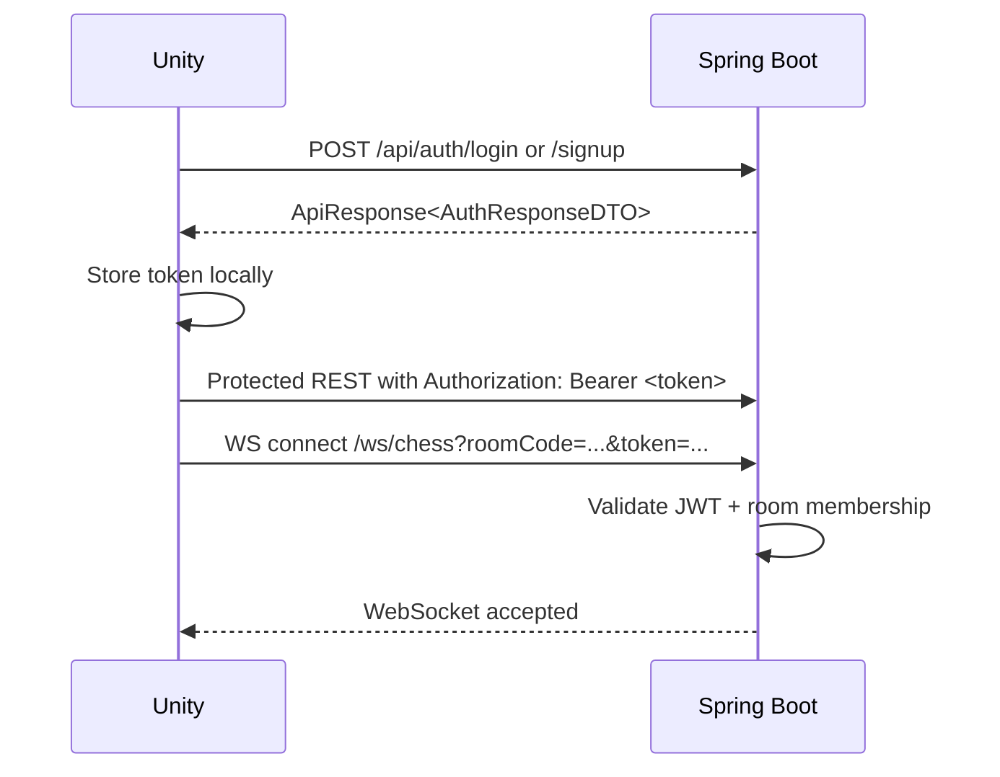
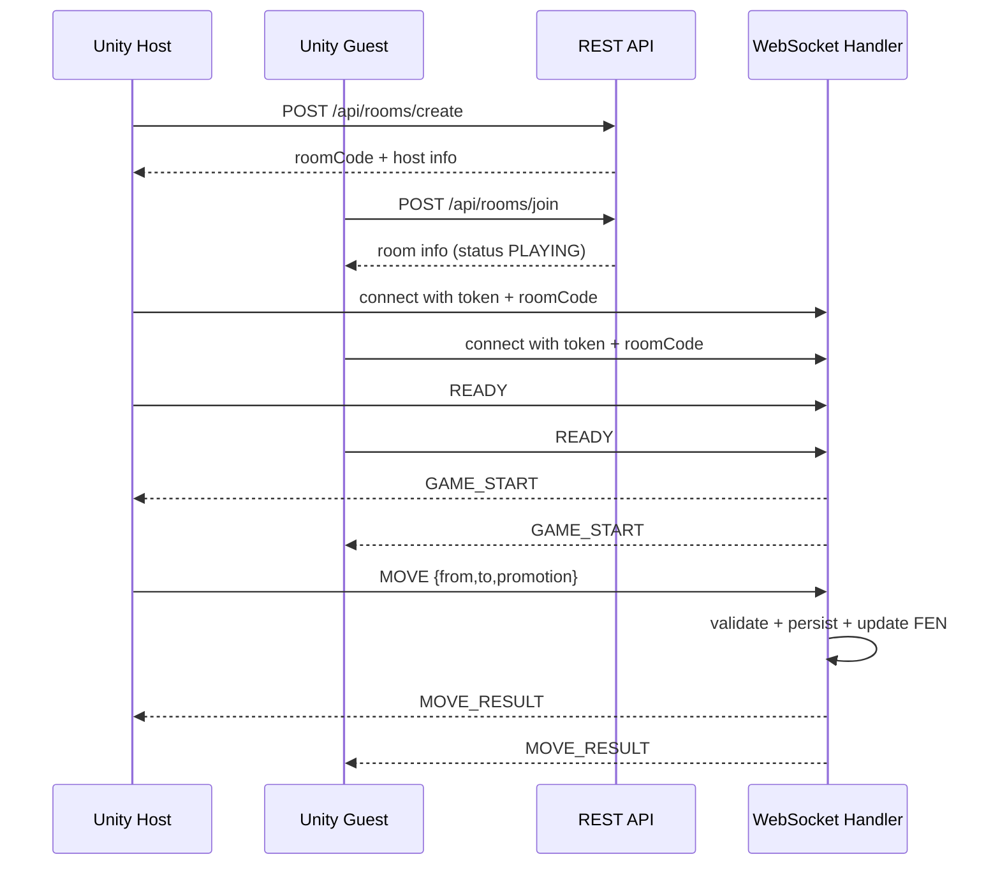
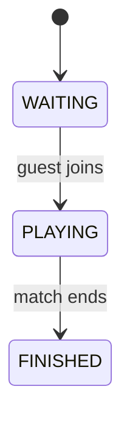

# Backend Analysis

Source analyzed from `D:\Stuurdy\AGU301\chess-lan-backend`.

## Overview

- Stack: Spring Boot + Spring Security + Spring Data JPA + raw WebSocket
- Database: PostgreSQL
- REST base: `http://<server>:8080`
- WebSocket endpoint: `ws://<server>:8080/ws/chess`
- Auth model: stateless JWT access token only
- Server authority: move legality, turn order, checkmate/draw detection, result, ELO

## Database Schema

`spring.jpa.hibernate.ddl-auto=update` means schema is generated/updated from entities.

### `users`

Fields inferred from `UserEntity`:

| Column | Type | Notes |
|---|---|---|
| `id` | UUID | Primary key |
| `created_at` | LocalDateTime | From `BaseEntity` |
| `updated_at` | LocalDateTime | From `BaseEntity` |
| `username` | varchar(50) | Unique, not null |
| `password` | text/varchar | BCrypt hash, not null |
| `elo` | integer | Not null, default 1200 |

### `rooms`

Fields inferred from `RoomEntity`:

| Column | Type | Notes |
|---|---|---|
| `id` | UUID | Primary key |
| `created_at` | LocalDateTime | From `BaseEntity` |
| `updated_at` | LocalDateTime | From `BaseEntity` |
| `room_code` | varchar(6) | Unique, not null |
| `host_id` | UUID | FK -> `users.id`, not null |
| `guest_id` | UUID | FK -> `users.id`, nullable |
| `status` | varchar(20) | `WAITING`, `PLAYING`, `FINISHED` |

### `matches`

Fields inferred from `MatchEntity`:

| Column | Type | Notes |
|---|---|---|
| `id` | UUID | Primary key |
| `created_at` | LocalDateTime | From `BaseEntity` |
| `updated_at` | LocalDateTime | From `BaseEntity` |
| `room_id` | UUID | One-to-one FK -> `rooms.id`, unique, not null |
| `white_player_id` | UUID | FK -> `users.id`, not null |
| `black_player_id` | UUID | FK -> `users.id`, not null |
| `winner_id` | UUID | FK -> `users.id`, nullable |
| `status` | varchar(20) | `ACTIVE`, `WHITE_WON`, `BLACK_WON`, `DRAW`, `ABORTED` |
| `termination_reason` | varchar(30) | `CHECKMATE`, `STALEMATE`, `DRAW_RULE`, `DRAW_AGREEMENT`, `RESIGNATION`, `ABANDONED`, `NONE` |
| `current_fen` | text | Canonical board state |
| `move_count` | integer | Accepted move count |
| `white_elo_before` | integer | Not null |
| `white_elo_after` | integer | Nullable until finish |
| `black_elo_before` | integer | Not null |
| `black_elo_after` | integer | Nullable until finish |
| `started_at` | LocalDateTime | Not null |
| `finished_at` | LocalDateTime | Nullable until finish |
| `version` | long | JPA optimistic lock |

### `match_moves`

Fields inferred from `MatchMoveEntity`:

| Column | Type | Notes |
|---|---|---|
| `id` | UUID | Primary key |
| `created_at` | LocalDateTime | From `BaseEntity` |
| `updated_at` | LocalDateTime | From `BaseEntity` |
| `match_id` | UUID | FK -> `matches.id`, not null |
| `player_id` | UUID | FK -> `users.id`, not null |
| `move_number` | integer | Unique per match |
| `request_id` | varchar(80) | Unique per match, used for idempotency |
| `from_square` | varchar(2) | e.g. `e2` |
| `to_square` | varchar(2) | e.g. `e4` |
| `promotion` | varchar(10) | Nullable |
| `notation` | varchar(10) | SAN-like notation |
| `fen_after` | text | Canonical state after move |

Constraints:

- `uk_match_move_number(match_id, move_number)`
- `uk_match_request_id(match_id, request_id)`

## Authentication

### Security Flow

- Public REST:
  - `POST /api/auth/signup`
  - `POST /api/auth/login`
- Public WebSocket handshake path:
  - `/ws/**`
- Protected REST:
  - everything else
- Authorization header format:
  - `Authorization: Bearer <token>`
- JWT subject:
  - username
- JWT claims:
  - `uid`: user UUID
  - `role`: `"PLAYER"`
  - `typ`: `"access"`
- JWT expiry:
  - `jwt.access-token-exp-minutes=30`
  - response exposes `expiresInSeconds = 1800`

### Refresh Token

- Not implemented
- No refresh endpoint exists
- Unity must re-login after token expiry, unless token is still valid

### Logout

- `POST /api/auth/logout`
- Backend is stateless and does not revoke JWT
- Intended behavior is client-side token deletion only

### Response Envelope

Successful REST responses use:

```json
{
  "code": 1000,
  "message": "Success message",
  "result": {},
  "path": "/api/...",
  "timestamp": "2026-06-27T00:00:00Z"
}
```

Validation errors use:

```json
{
  "code": 4000,
  "message": "Invalid request",
  "errors": {
    "field": "validation message"
  },
  "path": "/api/...",
  "timestamp": "2026-06-27T00:00:00Z"
}
```

### `POST /api/auth/signup`

Request:

```json
{
  "username": "player_one",
  "password": "123456"
}
```

Validation:

- `username`: required, 3..50 chars, regex `^[a-zA-Z0-9_]+$`
- `password`: required, 6..72 chars

Response:

```json
{
  "code": 1000,
  "message": "Signup success",
  "result": {
    "token": "<jwt>",
    "expiresInSeconds": 1800,
    "user": {
      "id": "uuid",
      "username": "player_one",
      "elo": 1200,
      "createdAt": "2026-06-27T00:00:00"
    }
  }
}
```

### `POST /api/auth/login`

Request:

```json
{
  "username": "player_one",
  "password": "123456"
}
```

Response:

```json
{
  "code": 1000,
  "message": "Login success",
  "result": {
    "token": "<jwt>",
    "expiresInSeconds": 1800,
    "user": {
      "id": "uuid",
      "username": "player_one",
      "elo": 1200,
      "createdAt": "2026-06-27T00:00:00"
    }
  }
}
```

Failure:

- Invalid credentials -> `401`, code `4001`, message `Username or password is incorrect`

### `POST /api/auth/logout`

Request:

- Header `Authorization: Bearer <token>`
- Empty body

Response:

```json
{
  "code": 1000,
  "message": "Logout success",
  "result": null
}
```

## User API

### `GET /api/users/me`

Request:

- Header `Authorization: Bearer <token>`

Response:

```json
{
  "code": 1000,
  "message": "Get profile success",
  "result": {
    "id": "uuid",
    "username": "player_one",
    "elo": 1200,
    "createdAt": "2026-06-27T00:00:00"
  }
}
```

### Missing User APIs

- No update profile endpoint
- No get-user-by-id endpoint
- No leaderboard endpoint
- No dedicated elo endpoint

## Room API

### `POST /api/rooms/create`

Request:

- Header `Authorization: Bearer <token>`
- Empty body

Response:

```json
{
  "code": 1000,
  "message": "Create room success",
  "result": {
    "id": "uuid",
    "roomCode": "ABC123",
    "hostId": "uuid",
    "hostUsername": "host_player",
    "guestId": null,
    "guestUsername": null,
    "status": "WAITING"
  }
}
```

### `POST /api/rooms/join`

Request:

```json
{
  "roomCode": "ABC123"
}
```

Validation:

- required
- regex `^[A-Za-z0-9]{6}$`

Response:

```json
{
  "code": 1000,
  "message": "Join room success",
  "result": {
    "id": "uuid",
    "roomCode": "ABC123",
    "hostId": "uuid",
    "hostUsername": "host_player",
    "guestId": "uuid",
    "guestUsername": "guest_player",
    "status": "PLAYING"
  }
}
```

### `GET /api/rooms/{roomCode}`

Request:

- Header `Authorization: Bearer <token>`

Response:

```json
{
  "code": 1000,
  "message": "Get room success",
  "result": {
    "id": "uuid",
    "roomCode": "ABC123",
    "hostId": "uuid",
    "hostUsername": "host_player",
    "guestId": "uuid",
    "guestUsername": "guest_player",
    "status": "WAITING|PLAYING|FINISHED"
  }
}
```

### Missing Room APIs

- No leave room endpoint
- No ready REST endpoint
- No list rooms endpoint
- No explicit room player-state REST endpoint beyond `host/guest/status`

## Match API

### Available REST APIs

- `GET /api/matches/history`
- `GET /api/matches/{matchId}`
- `GET /api/matches/active`

### Match Response Model

```json
{
  "id": "uuid",
  "roomCode": "ABC123",
  "whitePlayerId": "uuid",
  "whiteUsername": "host_player",
  "blackPlayerId": "uuid",
  "blackUsername": "guest_player",
  "winnerId": "uuid-or-null",
  "winnerUsername": "name-or-null",
  "status": "ACTIVE|WHITE_WON|BLACK_WON|DRAW|ABORTED",
  "terminationReason": "CHECKMATE|STALEMATE|DRAW_RULE|DRAW_AGREEMENT|RESIGNATION|ABANDONED|NONE",
  "currentFen": "fen-string",
  "moveCount": 12,
  "whiteEloBefore": 1200,
  "whiteEloAfter": 1216,
  "blackEloBefore": 1200,
  "blackEloAfter": 1184,
  "startedAt": "2026-06-27T00:00:00",
  "finishedAt": "2026-06-27T00:15:00",
  "moves": [
    {
      "id": "uuid",
      "moveNumber": 1,
      "playerId": "uuid",
      "playerUsername": "host_player",
      "from": "e2",
      "to": "e4",
      "promotion": null,
      "notation": "e4",
      "fenAfter": "fen-string",
      "playedAt": "2026-06-27T00:00:10"
    }
  ]
}
```

### Missing Match APIs

- No REST create match endpoint
- No REST submit move endpoint
- No REST resign endpoint
- No REST draw offer/accept endpoint
- No REST sync endpoint
- No standalone ELO endpoint

## WebSocket Protocol

### Transport

- Type: raw WebSocket
- Not STOMP
- Endpoint: `/ws/chess`
- Handshake query params required:
  - `roomCode`
  - `token`

Example:

```text
ws://SERVER_IP:8080/ws/chess?roomCode=ABC123&token=<jwt>
```

### Handshake Rules

The handshake interceptor validates:

- `token` exists
- `roomCode` exists and is not blank
- JWT parses successfully
- claim `typ == "access"`
- JWT has non-null JTI
- room exists
- authenticated user belongs to that room as host or guest

### Message Envelope

All server events use:

```json
{
  "type": "EVENT_NAME",
  "requestId": "optional-request-id",
  "roomCode": "ABC123",
  "sentAt": "2026-06-27T00:00:00Z",
  "payload": {}
}
```

### Supported Client Events

- `READY`
- `MOVE`
- `RESIGN`
- `DRAW_OFFER`
- `DRAW_ACCEPT`
- `SYNC_REQUEST`

### Supported Server Events

- `PLAYER_JOINED`
- `PLAYER_DISCONNECTED`
- `PLAYER_READY`
- `GAME_START`
- `MOVE_RESULT`
- `DRAW_OFFERED`
- `GAME_STATE`
- `GAME_OVER`
- `ERROR`

### `READY`

```json
{
  "type": "READY",
  "requestId": "ready-1",
  "payload": {}
}
```

### `MOVE`

```json
{
  "type": "MOVE",
  "requestId": "move-1",
  "payload": {
    "from": "e2",
    "to": "e4",
    "promotion": null
  }
}
```

### `RESIGN`

```json
{
  "type": "RESIGN",
  "requestId": "resign-1",
  "payload": {}
}
```

### `DRAW_OFFER`

```json
{
  "type": "DRAW_OFFER",
  "requestId": "draw-offer-1",
  "payload": {}
}
```

### `DRAW_ACCEPT`

```json
{
  "type": "DRAW_ACCEPT",
  "requestId": "draw-accept-1",
  "payload": {}
}
```

### `SYNC_REQUEST`

```json
{
  "type": "SYNC_REQUEST",
  "requestId": "sync-1",
  "payload": {}
}
```

### `PLAYER_JOINED`

```json
{
  "type": "PLAYER_JOINED",
  "payload": {
    "userId": "uuid",
    "username": "player_one"
  }
}
```

### `PLAYER_READY`

```json
{
  "type": "PLAYER_READY",
  "requestId": "ready-1",
  "payload": {
    "userId": "uuid",
    "username": "player_one",
    "readyCount": 1
  }
}
```

### `GAME_START`

```json
{
  "type": "GAME_START",
  "requestId": "ready-2",
  "payload": {
    "matchId": "uuid",
    "whitePlayerId": "uuid",
    "whiteUsername": "host_player",
    "blackPlayerId": "uuid",
    "blackUsername": "guest_player",
    "fen": "initial-fen",
    "turn": "WHITE"
  }
}
```

Notes:

- White is always room host
- Black is always room guest

### `MOVE_RESULT`

```json
{
  "type": "MOVE_RESULT",
  "requestId": "move-1",
  "payload": {
    "accepted": true,
    "newlyProcessed": true,
    "matchId": "uuid",
    "moveNumber": 1,
    "from": "e2",
    "to": "e4",
    "promotion": null,
    "notation": "e4",
    "fen": "fen-after-move",
    "turn": "BLACK",
    "check": false,
    "status": "ACTIVE"
  }
}
```

Terminal move can include nested `gameOver`.

### `DRAW_OFFERED`

```json
{
  "type": "DRAW_OFFERED",
  "requestId": "draw-offer-1",
  "payload": {
    "offeredBy": "player_one"
  }
}
```

### `GAME_STATE`

```json
{
  "type": "GAME_STATE",
  "requestId": "sync-1",
  "payload": {
    "matchId": "uuid",
    "status": "ACTIVE",
    "fen": "fen-string",
    "turn": "WHITE",
    "moveCount": 12,
    "whitePlayerId": "uuid",
    "blackPlayerId": "uuid"
  }
}
```

### `GAME_OVER`

```json
{
  "type": "GAME_OVER",
  "requestId": "resign-1",
  "payload": {
    "matchId": "uuid",
    "result": "BLACK_WON",
    "reason": "RESIGNATION",
    "winnerId": "uuid",
    "whiteEloBefore": 1200,
    "whiteEloAfter": 1184,
    "blackEloBefore": 1200,
    "blackEloAfter": 1216
  }
}
```

### `ERROR`

```json
{
  "type": "ERROR",
  "requestId": "move-99",
  "payload": {
    "code": "ILLEGAL_MOVE",
    "message": "Move is not legal"
  }
}
```

## Authentication Flow



## Multiplayer Flow



## Room Lifecycle



Important nuance:

- room status becomes `PLAYING` immediately on join
- actual match entity is created later, only when both sockets send `READY`

## Gaps Relative To Requested Unity Feature Set

These requested items do **not** have direct backend API support and must not be fabricated:

- refresh token flow
- update profile
- leave room REST/API
- ready REST/API
- create match REST endpoint
- submit move REST endpoint
- explicit room player-state API beyond `host/guest/status`
- heartbeat/ping protocol at backend WebSocket level
- reconnect/resume endpoint dedicated for room presence
- websocket resume session token
- dedicated ELO endpoint

## Practical Implications For Unity Implementation

1. Auth can be implemented with login/signup/logout/me only.
2. Waiting room can be implemented from REST room data plus WS join/ready events.
3. Ready button must use WebSocket `READY`, not REST.
4. Match start must wait for `GAME_START`.
5. Move sync must use square notation and canonical `fen`.
6. Reconnect can only be best-effort by reconnecting WS and then sending `SYNC_REQUEST`, with `GET /api/matches/active` as fallback.
7. There is no backend room-leave API, so leaving is only client disconnect behavior.
