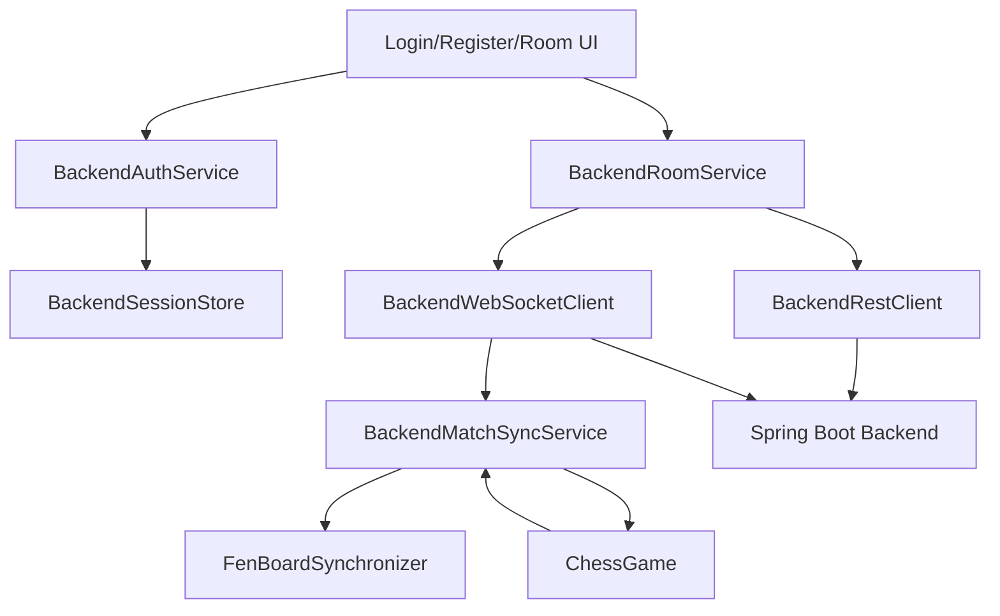
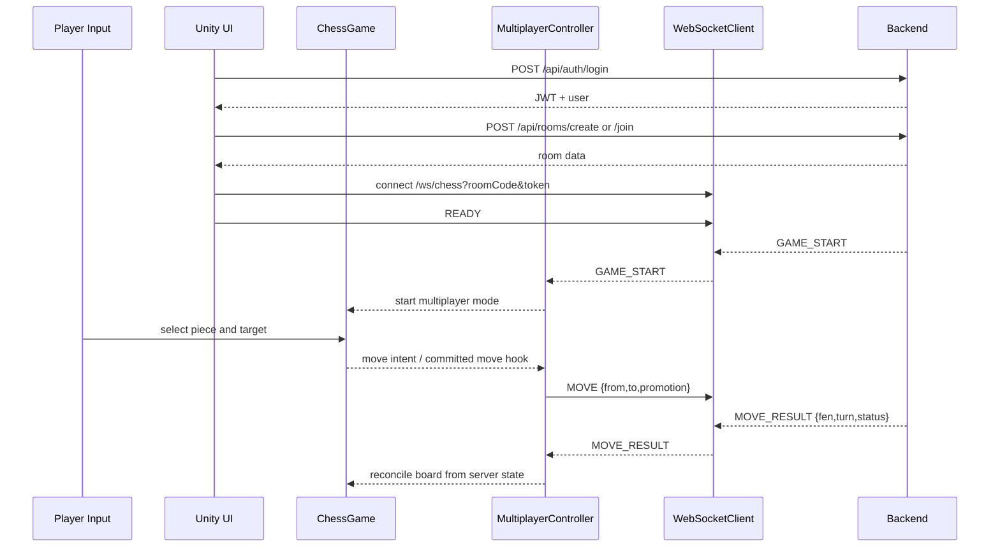

# Unity Multiplayer Proposal

Workspace analyzed: `D:\Stuurdy\AGU301\Chesss-but-Weird`

## Current Unity State

### Scene Structure

- Build settings currently include only one gameplay scene:
  - `Assets/Scenes/ChessClassic.unity`
- Runtime bootstrap auto-creates `ChessGame` if scene contains `Chessboard`
- `ChessTurnSelectionUI` is created dynamically by `ChessGame`
- Current auth/menu flow is also runtime-generated

### Board manager

- `Assets/Scripts/Chess/Core/ChessBoard.cs`
- Responsibilities:
  - generates logical 8x8 clickable tile grid
  - hover/highlight rendering
  - resolves tile world positions
  - board interaction enable/disable

### Game manager

- `Assets/Scripts/Chess/Core/ChessGame.cs`
- Responsibilities:
  - full offline game state
  - piece map
  - selection/input
  - legal move filtering
  - check/checkmate/draw logic
  - promotion flow
  - animation/audio
  - `MoveCommitted` event
  - LAN move application through `ApplyNetworkMove`

### Piece classes

- Base: `Assets/Scripts/Chess/Pieces/ChessPiece.cs`
- Derived:
  - `KingPiece`
  - `QueenPiece`
  - `RookPiece`
  - `BishopPiece`
  - `KnightPiece`
  - `PawnPiece`

### Move validator

- `Assets/Scripts/Chess/Rules/ChessMoveRules.cs`
- Piece-specific legality is distributed across piece subclasses
- Higher-level king safety / checkmate logic lives inside `ChessGame`

### UI manager

- `Assets/Scripts/Chess/Gameplay/ChessTurnSelectionUI.cs`
- Responsibilities:
  - main menu
  - side selection
  - promotion UI
  - game over UI
  - current turn / check status
  - attaches LAN and Online controllers dynamically

## Existing Networking/Auth Code

### Local auth to replace

- `Assets/Scripts/Chess/Profile/AuthController.cs`
- `Assets/Scripts/Chess/Profile/PlayerAuthService.cs`
- `Assets/Scripts/Chess/Profile/ProfileStore.cs`

Current behavior:

- local file-based account store
- no backend integration
- local win/loss/draw counters

### Existing LAN socket system to replace

- `Assets/Scripts/Chess/Networking/ChessLanController.cs`
- `Assets/Scripts/Chess/Networking/ChessLanSession.cs`
- `Assets/Scripts/Chess/Networking/ChessLanMove.cs`

Current behavior:

- custom TCP/UDP LAN discovery
- peer-to-peer move sync
- client-side game authority

### Existing relay online system to replace

- `Assets/Scripts/Chess/Networking/ChessOnlineController.cs`
- `Assets/Scripts/Chess/Networking/ChessOnlineSession.cs`

Current behavior:

- custom text protocol to `OnlineServer/online-server.js`
- not compatible with Spring Boot backend

## Constraints From Current Codebase

1. Offline gameplay is concentrated in `ChessGame`, so safest path is adapter/controller layering, not rewriting board logic.
2. Current networking code already hooks into `ChessGame.MoveCommitted` and `ChessGame.ApplyNetworkMove`.
3. Current `ApplyNetworkMove` expects board-coordinate moves, but backend protocol is square-string + canonical `fen`.
4. Backend is authoritative, while current offline and LAN systems are client-authoritative.

## Proposed Architecture

```text
ChessGame
    |
    +-- OfflineGameFlow
    |
    +-- BackendMultiplayerController
            |
            +-- BackendAuthService
            +-- BackendSessionStore
            +-- BackendRestClient
            +-- BackendWebSocketClient
            +-- BackendRoomService
            +-- BackendMatchSyncService
            +-- FenBoardSynchronizer
```

## Design Principles

- Do not modify backend
- Do not invent endpoints
- Keep offline mode intact
- Keep board rendering, animation, input system, and piece rules intact for offline
- For multiplayer, treat backend `fen` as source of truth

## Key Integration Strategy

### Offline mode

- Preserve current `ChessGame.BeginGame(...)`
- Preserve existing selection, movement, animations, sounds, rules

### Multiplayer mode

- Add a controller that subscribes to `ChessGame.MoveCommitted`
- Convert local board coordinates to algebraic squares
- Send `MOVE` to backend
- Reconcile rendered board against server `fen`

## Important Technical Risk

Current `ChessGame.TryMoveSelectedPiece` immediately mutates local board and can determine win/draw locally.

For backend-authoritative multiplayer, we need a multiplayer-specific gate so that:

- local move intent is captured
- server approves/rejects
- final state is reconciled from server `fen`

This is the main change point needed inside gameplay, but it can be isolated to multiplayer flow without rewriting offline rules.

## Proposed New Components

### `BackendSessionStore`

- persist JWT
- persist expiry timestamp
- persist current user id / username / elo
- auto-login check on startup

### `BackendAuthService`

- `SignupAsync`
- `LoginAsync`
- `LogoutAsync`
- `GetProfileAsync`

Backed by:

- `POST /api/auth/signup`
- `POST /api/auth/login`
- `POST /api/auth/logout`
- `GET /api/users/me`

### `BackendRestClient`

- JSON serialization/deserialization
- auth header injection
- standard `ApiResponse<T>` parsing
- error parsing

### `BackendWebSocketClient`

- raw websocket connect to `/ws/chess?roomCode=...&token=...`
- send JSON events
- receive event envelope
- reconnect loop
- post-reconnect `SYNC_REQUEST`

Note:

- Backend does not define ping/pong WS messages
- Client heartbeat can only be local health tracking plus reconnect attempts

### `BackendRoomService`

- create room
- join room
- get room by code
- maintain waiting-room state
- send `READY`

### `BackendMatchSyncService`

- handle `GAME_START`
- handle `MOVE_RESULT`
- handle `GAME_STATE`
- handle `GAME_OVER`
- map server status/result to Unity UI
- coordinate with `ChessGame`

### `FenBoardSynchronizer`

- parse FEN from backend
- map FEN to current Unity board
- apply board state visually
- set turn from FEN
- trigger end-state UI from backend result

## Multiplayer Architecture Diagram



## Sequence Diagram



## Proposed File Changes

### Replace or refactor existing auth layer

- `Assets/Scripts/Chess/Profile/AuthController.cs`
- `Assets/Scripts/Chess/Profile/PlayerAuthService.cs`
- `Assets/Scripts/Chess/Profile/ProfileStore.cs`
- `Assets/Scripts/Chess/Profile/PlayerProfile.cs`
- `Assets/Scripts/Chess/Profile/AuthAccount.cs`

### Replace backend-incompatible multiplayer layer

- `Assets/Scripts/Chess/Networking/ChessLanController.cs`
- `Assets/Scripts/Chess/Networking/ChessLanSession.cs`
- `Assets/Scripts/Chess/Networking/ChessOnlineController.cs`
- `Assets/Scripts/Chess/Networking/ChessOnlineSession.cs`
- `Assets/Scripts/Chess/Networking/ChessLanMove.cs`

### Extend gameplay only where needed for authoritative sync

- `Assets/Scripts/Chess/Core/ChessGame.cs`
- `Assets/Scripts/Chess/Gameplay/ChessTurnSelectionUI.cs`

### Add new backend-driven networking/auth classes

- `Assets/Scripts/Chess/Backend/BackendApiResponse.cs`
- `Assets/Scripts/Chess/Backend/BackendRestClient.cs`
- `Assets/Scripts/Chess/Backend/BackendSessionStore.cs`
- `Assets/Scripts/Chess/Backend/BackendAuthService.cs`
- `Assets/Scripts/Chess/Backend/BackendRoomService.cs`
- `Assets/Scripts/Chess/Backend/BackendWebSocketClient.cs`
- `Assets/Scripts/Chess/Backend/BackendMatchSyncService.cs`
- `Assets/Scripts/Chess/Backend/BackendDtos.cs`
- `Assets/Scripts/Chess/Backend/FenBoardSynchronizer.cs`
- `Assets/Scripts/Chess/Backend/BackendMultiplayerController.cs`

## Backend Gaps That Must Be Respected

These cannot be implemented as true backend features without backend changes:

- refresh token
- backend room leave API
- backend profile update API
- dedicated backend ready REST
- dedicated reconnect/session-resume API
- backend websocket heartbeat response contract

## Implementation Plan After Approval

1. Replace local auth with REST/JWT session handling.
2. Replace current custom LAN/online UI flow to call backend room APIs.
3. Replace custom socket sessions with raw WebSocket backend client.
4. Add multiplayer mode to `ChessGame` that submits move intent and reconciles from server state.
5. Add reconnect + `SYNC_REQUEST` + `GET /api/matches/active` fallback recovery.
6. Verify offline flow still works unchanged.
